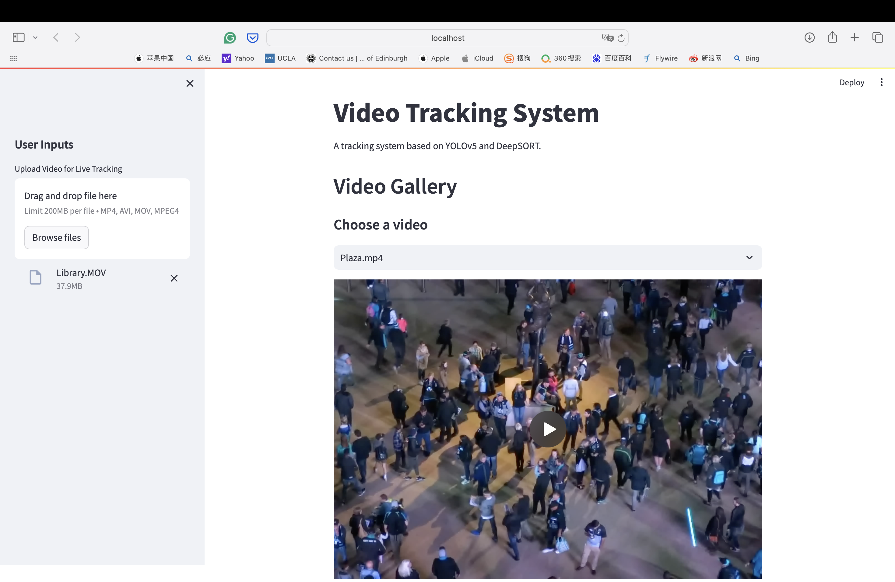
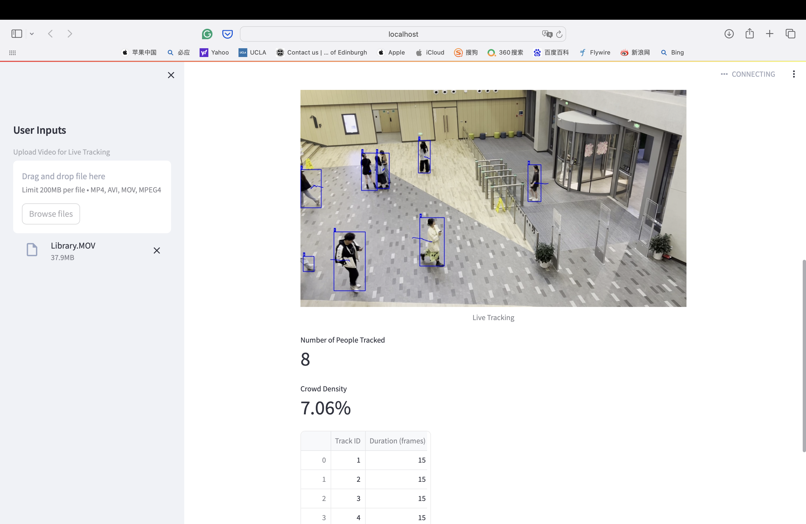

# COMP3065 Coursework

## Introduction
DeepTracker is an object tracking system using YOLOv5m for detection and DeepSORT for tracking.

<p float="left">
  
   
</p>

## System Requirements
This project is implemented with Python 3.8, Pytorch 1.11.0, and torchvision 0.12.0. 
GUI is developed based on Steamlit. To ensure the execution, the code is set to run on the CPU by default. To run the code on GPU, please set the `use_cuda=True` when initializing the DeepSORT
and move the YOLOv5m model to the GPU.

## Installation
To install the streamlit package, run the following command:
```bash
pip install streamlit
```

## Project Structure
- `deep_sort/`: Contains modules and scripts related to the Deep SORT algorithm.
- `detector.py`: Script for handling object detection.
- `tracker.py`: Integrates the detection and tracking functionalities.
- `yolov5m.pt`: Pre-trained YOLOv5m model weights loaded from the Ultralytics GitHub repository.
- `GUI.py`: Streamlit-based web GUI.
- `demo_export.py`: A script for that read in data (support both image and video) and exporting tracking results.
- `Gallery/`: Directory containing sample videos for demonstration.

## Acknowledgements
This project uses YOLOv5m for object detection and DeepSORT for tracking. 

- **YOLOv5**: Visit the [YOLOv5 Ultralytics GitHub repository](https://github.com/ultralytics/yolov5).
- **DeepSORT**: More information on the tracking algorithm can be found at the [DeepSORT repository](https://github.com/nwojke/deep_sort).

## Usage
Run `GUI.py` using Streamlit to start the web application:
```bash
streamlit run GUI.py --server.enableXsrfProtection false
```
To export a video with tracking results, set the input video path and output video path in `demo_export.py` and run the script:
```bash
python demo_export.py
```

